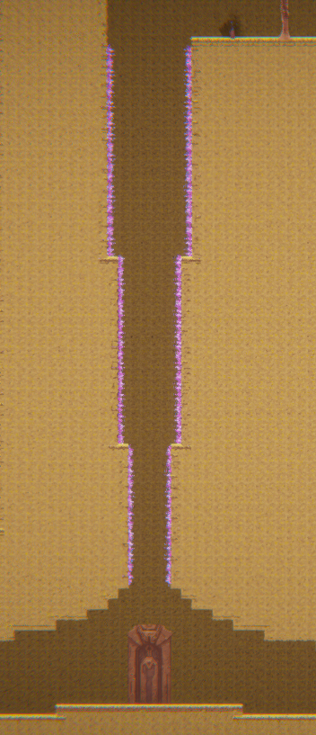

# COMP2150  - Level Design Document
### Name: Hans (Gabriel) Kagayutan
### Student number: 47465670

## 1. Player Experience (~700 words)

### 1.1. Discovery
Throughout the level, the player learns the basics and extents of the game's mechanics. My level design structures learning by regularly testing the players understanding of the limitations of mechanics. A clear example of this is would be the first 3 jumps of Section #1. The first two jumps are easy and help familiarise the player with the jumping mechanic. The third jump, on the other hand, is designed in such a way that showcases the upper limits of the jump mechanic. Either side of the pit is level with the other and 6 units apart. At this distance, the player is required to jump at the last possible moment to clear the gap. Furthermore, the height of the right side of the pit is 6 units high. At this height, the player is unable to reach the top. The left side of the pit is elevated by 1 unit (5 blocks high). The player can reach the top of this side of the pit to reattempt the jump. This first test ensures that, moving forward, the player understands the limitations of the jump mechanic.

### 1.2. Drama
The peaks of intensity increase over the course of the level; modulated by the obtaining of keys. The end of each section has a difficult challenge that raises the intensity level significantly. Immediately after overcoming the challenge, the player is rewarded with respite and a key; bringing the intensity levels back down. 

Each section also has smaller respite zones in the form of checkpoints and health pickups. These provide a short moment of relief but tension still remains as the player can still see obstacles ahead.

### 1.3. Challenge
There are 3 main challenges in my level.      
  
**1st Challenge: Hard Spike Jump**      
This jump at the end of Section #1 features the first instance of spikes on ceiling. Unlike the previous jumps, this jump limits the jump height of the player. The player must precisely control the power their jump as the not hit the spikes at the top or fall into the acid pool at the bottom.

The player's initial attempts will cause frustration. To help mitigate this and keep the player in the flow state, I added a small rock. This rock indicates the exact moment the player must begin their jump in order to avoid both the spikes and the acid.
  
  
**2nd Challenge: Jump and Shoot**    
Section #2 features a series of encounters that requires the player to discover the dynamic of jumping and shooting at the same time. The section starts off easy with a single Spitter on each platform. Then, on the third platform, there are 3 Spitters blocking the way.  

The player is unable to progress to the next platform without taking out the Spitters. If the player attempts to jump on the platform without taking out at least the first Spitter, they will be knocked back and fall onto the spikes below. The player must therefore discover that they can shoot while jumping in order to progress through this section.  
  
  
**3rd Challenge: Bunch of Enemies**    
Section #3 is all about combat. Up until this point, the enemies have just been there to add little bit of difficulty to the primarily platforming focused sections. In Section #3 defeating the enemies is the main focus. Each room has a switch that is guarded by enemies. This switch is connected to a door that will open and grant access to the next room.

To ensure that Section #3 was the hardest section to clear, I restricted the number of health pickups. Up until now, health pickups have been available at every checkpoint. In Section #3 there is only one room with health pickups. On top of that, the health pickups are guarded by enemies.
  
  
### 1.4. Exploration
I will admit here that I was not paying attention when reading the assessment information as I did not design a non-linear level. As such, my level does not facilitate player autonomy for exploration. Despite this, my level does still aim to make each space distinct and memorable.  
   
For example Section #2 features a pit full of Chompers.

The Chompers don't do much in terms of difficulty (the spikes and acid already handle that). But I decided to put them in anyways because I thought it'd be more interesting and memorable.  
  
   
Even the connective spaces are distinct. The final loopback to the door features a long fall with spikes lining the walls. This provides a final epic leap of faith at the end of level.

## 2. Core Gameplay (~400 words)

### 2.1. Weapon Pickup (Staff)

  

### 2.2. Checkpoints, Spikes, Chompers

  

### 2.3. Moving Platforms

  

### 2.4. Health Pickups, Acid, Spitters, Passthrough Platforms

  

### 2.5. Keys

  

### 2.6. Weapon Pickup (Gun)

  

## 3. Spatiotemporal Design
### 3.1. Molecule Diagram

### 3.2. Level Map – Section 1

### 3.3.	Level Map – Section 2

### 3.4.	Level Map – Section 3

## 4. Iterative Design (~400 words)
When designing each section I would first draw up the level maps seen above.  
    
When drawing the level maps, I would consider what mechanics I'd want to feature for each section. Section #1 was simply to introduce and test the jumping and melee attack mechanic. Section #2 introduced the switch, and gun mechanics and also focused on the dynamic of jumping and shooting at the same time. Section #3 was simply a focused on combat with the enemies.  
          
After I had decided what each section's focus was, I began constructing the level.  
I would begin constructing a setion from whereever I had marked as the starting point (indicated by the red stick figure). Once a portion of the section had been completed, I would run and test it. If I found any changes I'd want to make, I would go back to the editor and change them.  
         
One such change, in Section #1, was to move the spikes up so that they were visible to the player. As seen in the level map for Section #1, the spikes remained on the floor of the section. This was an issue I immediately noticed when it came time to test the jump over first spike pit. The player could not see the spikes. My intention was for the player to feel like the jump had consequence as the previous jumps simply allowed the player to hop out of the pit and try again. If the player's could not see the spikes, how were they supposed to know that indeed more dangerous. And so to solve this issue, I simply moved the spikes up so that they were visible to the player.  
      
Another change I made, also in Section #1, was to move the first Spitter (as well as the platform it was on) to the right. I found that went a player tried to jump over the gap they would run into the Spitter and get knocked back into the pit.
        
An aspect of my level design that could be improved through further iterative design would be the rooms in Section #3. The first 3 rooms in Section #3 are distinct from one another but the last room simply copies room 1's layout and adds more enemies. In future, I must consider the intended player experience of each room and ensure I am not repeating experiences when not necessary.